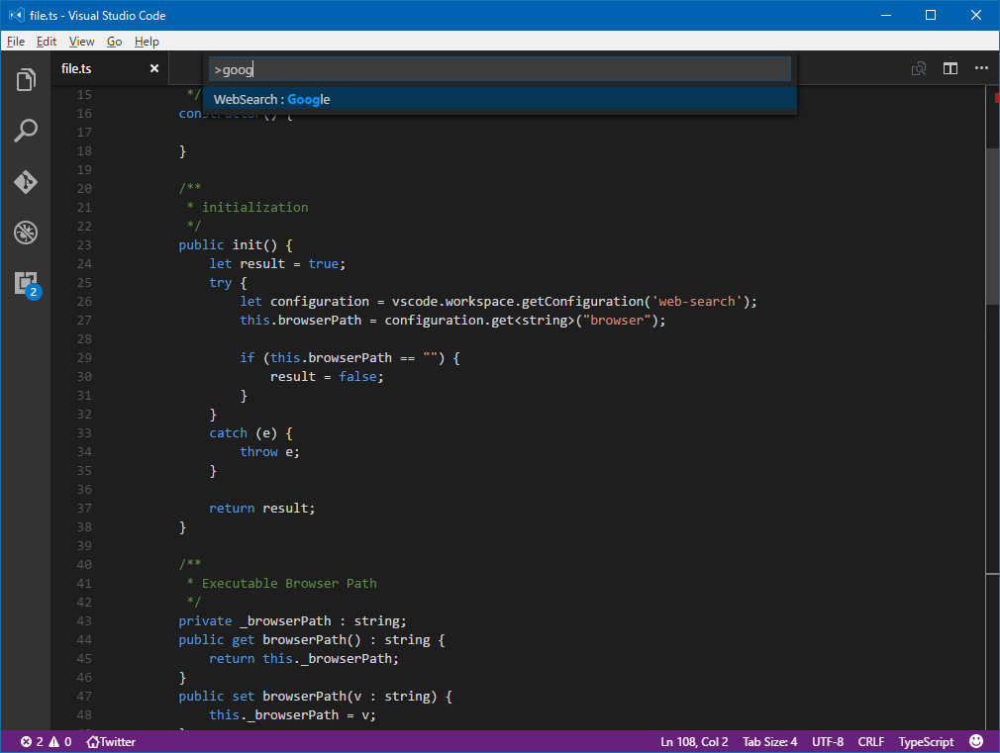

# web-search README
This extension provides some search function.
The supported search engine is follow.
 - Google
 - MSDN
 - Reddit
 - Visual Studio Code Reference
 - StackOverflow

## Features
if your want to search some word on Google.
you type Ctrl+Shift+P, and type 'google'.

input search word. e.g. vscode.

you'll look the search result on google your using browser.

## Extension Settings
Your need to set your using browser path.

* `web-search.browser`: your using browser.

## Release Notes

### 1.0.0

Initial release of web-search.

## Working with Markdown

**Enjoy!**